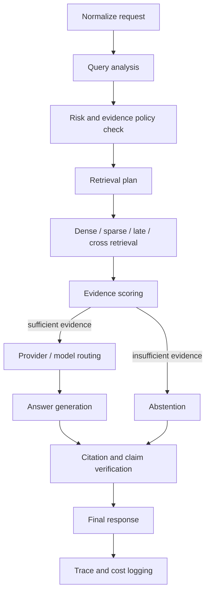

# Architecture

ContextGate is split as a platform-style Python monorepo:

```text
domain -> application -> ports -> adapters -> apps
```

The top-level `src/contextgate` package intentionally contains only `__init__.py` and subpackages.
Feature files live inside explicit layers:

```text
contextgate/
  domain/
    documents.py, retrieval.py, evidence.py, gateway.py, evaluation.py, errors.py
  application/
    dto.py, retrieval.py, use_cases.py
  ports/
    vector_index.py, router.py, repositories.py
  adapters/
    sqlalchemy/, qdrant/, fastembed/, langgraph/, litellm/, mlflow/, celery/, local/
  apps/
    api/, cli/, worker/, chainlit/, mlflow/, container.py
  config/
    settings.py, policies.py
  observability/
    metrics.py
```

The rule is enforced by tests. `domain`, `application` and `ports` do not import FastAPI, Pydantic
API schemas, SQLAlchemy, Qdrant, MLflow, Celery, Redis, Chainlit or LangGraph. FastAPI routes and
Celery tasks call application use cases instead of reaching into infrastructure services directly.

The `apps/container.py` module is the composition root. It wires SQLAlchemy repositories, Qdrant,
FastEmbed, MLflow, LiteLLM, Celery, traces, cost ledger and LangGraph into application use cases.
That container is allowed to know about adapters; domain and application code are not.

Database migrations are colocated with the SQLAlchemy adapter:

```text
src/contextgate/adapters/sqlalchemy/
  models.py
  alembic.ini
  migrations/
```

Run migrations with `alembic -c src/contextgate/adapters/sqlalchemy/alembic.ini ...`.

## Boundary Mapping

Public interfaces translate into application DTOs at the edge:

```text
FastAPI Pydantic schema -> application DTO -> use case -> domain result -> FastAPI response schema
CLI args                -> application DTO -> use case
Celery job payload      -> application DTO/job runner -> use case
```

The application layer uses dataclasses from `contextgate.application.dto`, not API schemas. This
keeps HTTP, CLI and worker contracts replaceable without changing gateway behavior.

## Request Runtime



The graph state is JSON-serializable. Runtime dependencies are injected through LangGraph context
or through application ports; graph nodes do not instantiate providers, Qdrant clients or databases.

When `CONTEXTGATE_DATABASE_BACKEND=postgres`, the graph is compiled with
`langgraph-checkpoint-postgres`. ContextGate uses the request/run id as LangGraph `thread_id`, so an
answer run has a stable checkpoint lineage. SQLite development mode skips the Postgres saver.
`CONTEXTGATE_DATABASE_URL` is still supported as an explicit override for tests and custom
deployments.

## Trace Events

Answer runs emit persisted node events with a monotonic `sequence`:

```text
query_analyzed
retrieval_started
retrieval_hit
evidence_scored
provider_selected
token_delta
citation_verified
final
```

The native API exposes those events through `GET /api/v1/runs/{run_id}/events` as SSE and through
`GET /api/v1/runs/{run_id}/trace` as JSON. The cost ledger is separate and idempotent, so repeated
record attempts for the same provider call do not double count cost.

## Retrieval Engine

Policies:

- `fast`: dense retrieval.
- `balanced`: dense + BM25, RRF fusion, ColBERT late-interaction reranking when the language/model
  supports it.
- `accurate`: larger prefetch, ColBERT and optional cross-encoder provider.
- `auto`: learned SLO-aware router; falls back to `balanced` when no champion exists or the query is
  out of distribution.

Qdrant managed collections contain named vectors:

- `dense`: cosine vector for semantic first stage.
- `sparse`: BM25 sparse vector with Qdrant IDF.
- `late`: ColBERT token multivector with MaxSim and HNSW disabled.

Collections are validated for vector names, dimensions, distance functions, sparse IDF and
late-interaction multivector settings before traffic is served. Metadata filters are index-first to
stay compatible with Qdrant strict-mode behavior.

## Evidence-Gated Runtime

ContextGate treats retrieved evidence as the permission boundary for generation.

The evidence model computes:

- answerability score;
- retrieval coverage score;
- top-k support score;
- unsupported claim candidates;
- citation validity.

If retrieval abstains or support is below threshold, the graph bypasses generation and returns a
machine-readable abstention. If a generated answer cites a missing chunk or invalid index, the answer
is marked ungrounded.

`AnswerWithEvidence` is the canonical application use case for native and OpenAI-compatible answer
paths. It records the actual runtime outcome: `abstention` after evidence rejection, `extractive`
after fallback generation, or the selected configured provider after generation is allowed.

## Provider And Cost Routing

The provider registry supports:

- `extractive` fallback provider;
- LiteLLM/OpenAI-compatible provider when configured;
- local/Ollama-style provider hooks.

Policy inputs include latency budget, cost budget, maximum context tokens, allowed providers and
fallback order. The v0.1 cost ledger stores provider, model, token/unit counts, estimated cost,
request id and run id.

## Jobs

Jobs are durable records with:

- `queued`, `running`, `succeeded`, `failed`, `cancelled` status values;
- idempotency key;
- retry count;
- started/finished timestamps;
- structured error payload.

Celery is isolated behind `JobQueue`. Job execution is in application use cases, while adapters hide
SQLAlchemy sessions and the existing ingestion/benchmark/router services.

## Evaluation

Benchmarks log dataset fingerprints to MLflow and write HTML reports. Query variants can share
`group_id`, allowing group-aware train/validation splits for router training.

Gateway-level evaluation tracks retrieval quality, answerability, citation validity, unsupported
claim rate, latency, estimated cost, provider fallback rate and SLO violations. Router promotion is
intended to require quality, latency and cost gates before MLflow aliases move from `candidate` to
`champion`.

## Failure Behavior

- Missing/OOD router: use `balanced`.
- Latency budget below measured profile: use `fast`.
- Retrieval score below threshold: abstain before generation.
- LLM disabled: return extractive cited answer.
- Redis unavailable for rate limiting: fail open for API traffic; Celery broker failures still
  surface as job infrastructure errors.
- Qdrant sync copies into a managed collection and never mutates the source collection.

## Deferred Scope

v0.1 does not include multi-tenant RBAC, Kubernetes manifests, OCR, semantic cache implementation or
a custom React UI. Interfaces exist where replacement is expected, especially job queue, providers,
cache and router repository.
